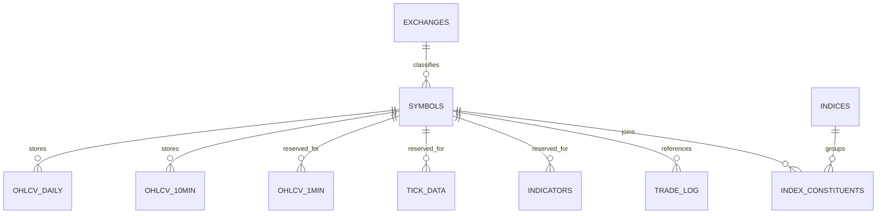

# Trading Service

This page documents the current trading-service database setup implemented in:

- `server/trading/docker-compose.yml`
- `server/trading/initdb/*.sql`
- `server/trading/data-collector/src/*.py`
- `server/trading/data-collector/scripts/*.py`
- `server/scripts/trading/*.sh`
- `server/scripts/backup/backup-postgres.sh`
- `server/scripts/setup/install.sh`

No Mermaid chart existed for the trading service before this page.

## Current state summary

- Primary database container: `trading_timescaledb` (`timescale/timescaledb:latest-pg16`), internal-only on the trading Docker network.
- External data sources: IBKR via the `trading_tws` container, the ASX daily constituent ZIP, and ASX quarterly rebalancing PDFs.
- Current checked-in table writers: `bootstrap_constituents.py`, `constituent_sync.py`, `bar_history.py`, and `bootstrap_asx_daily.py`. Separate shell scripts create backups and archives outside the database.
- Current checked-in readers: `parquet_export.py`, `verify-trading-data.sh`, `restore-trading.sh`, and `backtesting/data_loader.py`.
- The SQL schema is ahead of the runtime wiring. Some tables exist and have retention/compression policies, but the current Python service does not populate them yet.

## Core schema relationships



### Raw tables

- Lookup tables: `exchanges`, `symbols`, `indices`
- Membership table: `index_constituents`
- Time-series hypertables: `ohlcv_daily`, `ohlcv_10min`, `ohlcv_1min`, `tick_data`, `indicators`, `account_snapshot`, `trade_log`

### Derived SQL objects

- Continuous/materialized aggregates: `ohlcv_1h`, `daily_vwap`, `sma_20_10min`, `volatility_20d`
- Views/functions: `indicators_with_symbol`, `asx200_current`, `index_universe_full`, `universe_at_date()`

## Current update and ownership flow

```mermaid
flowchart TB
    subgraph Sources["External sources"]
        ibkr["IBKR historical data<br/>via TWS API"]
        asxZip["ASX daily constituent ZIP<br/>(ASX300 filtered to ASX200)"]
        asxPdf["ASX quarterly rebalancing PDFs"]
    end

    subgraph Runtime["Runtime containers and scripts"]
        tws["trading_tws<br/>TWS + API socket"]
        main["data-collector/src/main.py<br/>APScheduler runtime"]
        bars["bar_history.py"]
        sync["constituent_sync.py"]
        bootConst["scripts/bootstrap_constituents.py"]
        bootDaily["scripts/bootstrap_asx_daily.py"]
        exportPy["parquet_export.py"]
        exportSh["server/scripts/trading/export-parquet.sh<br/>cron 04:00 UTC"]
        b2Sh["server/scripts/trading/sync-trading-b2.sh<br/>cron 05:00 UTC"]
        backupSh["server/scripts/backup/backup-postgres.sh<br/>cron 02:00 UTC"]
        verifySh["server/scripts/trading/verify-trading-data.sh<br/>Sun 06:00 UTC"]
        restoreSh["server/scripts/trading/restore-trading.sh<br/>on demand"]
        install["server/scripts/setup/install.sh<br/>installs cron jobs"]
    end

    subgraph DB["trading_timescaledb / trading database"]
        exchanges["exchanges"]
        symbols["symbols"]
        indices["indices"]
        members["index_constituents"]
        daily["ohlcv_daily"]
        ten["ohlcv_10min"]
        one["ohlcv_1min<br/>(schema only)"]
        tick["tick_data<br/>(schema only)"]
        indicators["indicators<br/>(schema exists, no current writer)"]
        account["account_snapshot<br/>(schema only)"]
        trades["trade_log<br/>(schema only)"]
        derived["derived SQL objects<br/>ohlcv_1h, daily_vwap, sma_20_10min,<br/>volatility_20d, universe_at_date(), views"]
    end

    subgraph Archive["Exports, backups, and consumers"]
        parquet["/data/trading/parquet"]
        b2["Backblaze B2"]
        backtests["backtesting/data_loader.py"]
    end

    ibkr --> tws --> main
    main -->|startup + weekly sync| sync
    main -->|startup backfill + daily ASX job| bars
    main -->|02:00 UTC nightly export| exportPy

    asxZip --> sync
    asxPdf --> bootConst
    bootConst -->|upsert / close members| members
    bootDaily -->|load ever-members| members
    bootDaily -->|run_backfill_all()| bars
    bootDaily -->|manual export after bootstrap| exportPy

    sync -->|get_or_create_symbol()| symbols
    sync -->|upsert_constituent() / close_constituent()| members

    bars -->|get_or_create_symbol()| symbols
    bars -->|upsert_ohlcv_daily()| daily
    bars -.->|backfill_10min() exists but is not scheduled by main.py| ten

    exchanges --> symbols
    indices --> members
    symbols --> members
    ten -->|continuous aggregates| derived
    daily -->|volatility MV| derived
    members -->|universe_at_date() / views| derived
    symbols -->|views| derived

    exportPy -->|SELECT ohlcv_daily| daily
    exportPy -->|JOIN symbols / exchanges| symbols
    exportPy -->|writes Snappy Parquet files| parquet
    exportSh -.->|intended wrapper: python -m parquet_export| exportPy
    install --> backupSh
    install --> exportSh
    install --> b2Sh
    install --> verifySh

    parquet -->|rclone copy| b2Sh --> b2
    backupSh -->|pg_dump trading DB| b2
    verifySh -->|row counts / latest bar / compression| daily
    verifySh --> ten
    verifySh --> tick
    verifySh --> indicators
    verifySh --> trades
    verifySh --> parquet
    verifySh --> b2
    restoreSh -->|download pg_dump and restore DB| b2
    restoreSh -->|recreates and restores| symbols
    restoreSh -->|recreates and restores| members
    restoreSh -->|recreates and restores| daily

    parquet -->|preferred backtest source| backtests
    daily -->|fallback if Parquet missing| backtests
    members -->|point-in-time universe windows| backtests
```

## What is writing what today

| Object | Current writer(s) | Source of truth | Trigger |
|---|---|---|---|
| `symbols` | `db.get_or_create_symbol()` via `bar_history.py`, `constituent_sync.py`, `bootstrap_constituents.py` | ASX ZIP/PDF tickers and IBKR contract context | startup, weekly sync, manual bootstraps |
| `index_constituents` | `constituent_sync.py`, `bootstrap_constituents.py` | ASX daily ZIP and ASX historical PDFs | startup + weekly sync, manual bootstrap |
| `ohlcv_daily` | `bar_history.py` via `run_backfill_all()` and `run_daily_update()`; `bootstrap_asx_daily.py` calls `run_backfill_all()` | IBKR/TWS historical bars | startup, daily ASX schedule at `06:15 UTC`, manual bootstrap |
| `ohlcv_10min` | `bar_history.backfill_10min()` exists | IBKR/TWS historical bars | not currently called by `main.py` |
| `ohlcv_1min` | no checked-in writer | n/a | schema only |
| `tick_data` | no checked-in writer | n/a | schema only |
| `indicators` | `upsert_indicator()` SQL helper exists, but no Python caller currently uses it | derived from bar data | schema only |
| `account_snapshot` | no checked-in writer | n/a | schema only |
| `trade_log` | no checked-in writer | n/a | schema only |
| `/data/trading/parquet` | `main.py` schedules `run_nightly_export()`; `bootstrap_asx_daily.py` exports after a manual bootstrap | reads `ohlcv_daily` + `symbols` | scheduled in-process at `02:00 UTC`; manual bootstrap |
| `backups/postgres/trading_*.sql.gz` and B2 copy | `backup-postgres.sh` | full `trading` PostgreSQL database | cron at `02:00 UTC` |

## Important current-state gaps and overlaps

### Implemented vs schema-prepared

- `03-hypertables.sql` creates `ohlcv_1min`, `tick_data`, `indicators`, `account_snapshot`, and `trade_log`, but the current checked-in Python service does not populate them.
- `07-continuous-aggs.sql` and `08-materialized-indicators.sql` prepare derived objects on top of `ohlcv_10min`, `ohlcv_daily`, and `indicators`, but only `ohlcv_daily` is clearly populated by the main runtime today.
- `bar_history.py` contains `backfill_10min()`, but `main.py` never calls it. The active scheduled path is `_asx_daily_job()` which only runs `run_daily_update()` for ASX200 ever-members.
- `main.py` comments mention both ASX and US daily updates, but the checked-in scheduler only registers the ASX job.

### Export and backup ownership

- `main.py` schedules `run_nightly_export()` at `02:00 UTC`.
- `install.sh` also installs `export-parquet.sh` at `04:00 UTC`.
- As checked in, `export-parquet.sh` runs `python -m parquet_export`, but `server/trading/data-collector/src/parquet_export.py` has no `__main__` block or project script entrypoint. That makes the `main.py` scheduler the clearly wired export path in the current repo state; the cron wrapper looks intended but incomplete.
- `parquet_export.py` currently exports daily Parquet files for ASX and US in `run_nightly_export()`. It defines `export_10min_month()`, but the nightly job does not call it.

### Read paths

- Backtesting prefers Parquet via `backtesting/data_loader.py::load_from_parquet()`.
- When Parquet is not available, the same loader can query `ohlcv_daily` directly from TimescaleDB via `load_from_timescaledb()`.
- Point-in-time universe selection comes from `index_constituents` through direct SQL windows in `load_constituent_universe()` and the `universe_at_date()` function.
